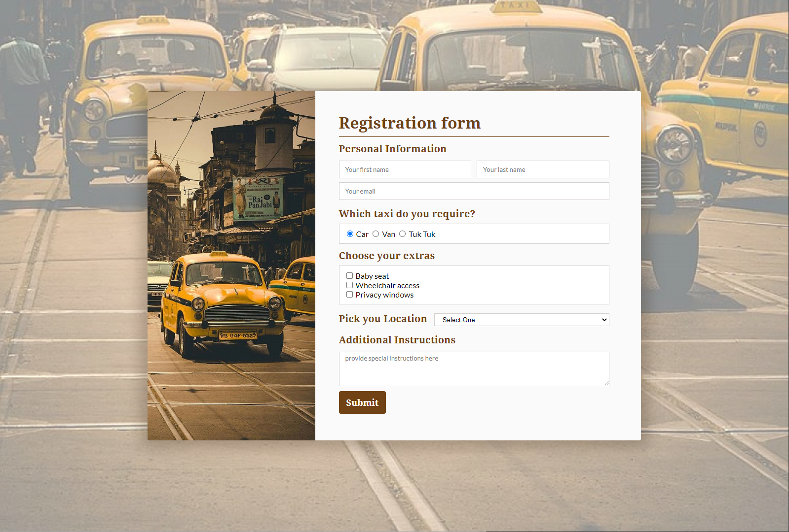

# A CSS Puzzle

In this activity, you have to recreate the following webpage **without writing any CSS at all. None. Zip. Nada.**

## Uhm. How? You ask.

All of the CSS has been provided but the HTML doesn't seem to reference that CSS at all.

The goal of this activity is to assign the classes to the HTML elements in order to reproduce the above screenshot.

## Steps

1. Get into your study groups.
2. Launch a zoom meeting in that channel. (I'll use that link to pop into your meeting and _maybe_ answer a question or two.)
3. Spend a few minutes looking through the codebase.
4. Discuss and put the puzzle back together!
